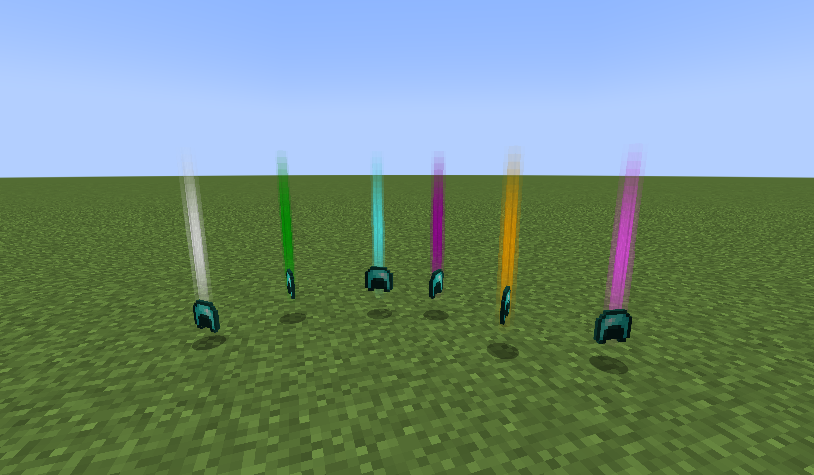

# Enhanced Armaments Reload Beams

Set colorful beams for [Loot Beams](https://www.curseforge.com/minecraft/mc-mods/loot-beams) mod by rarities in the [Enhanced Armaments Reload](https://www.curseforge.com/minecraft/mc-mods/enhanced-armaments-reload) mod!

